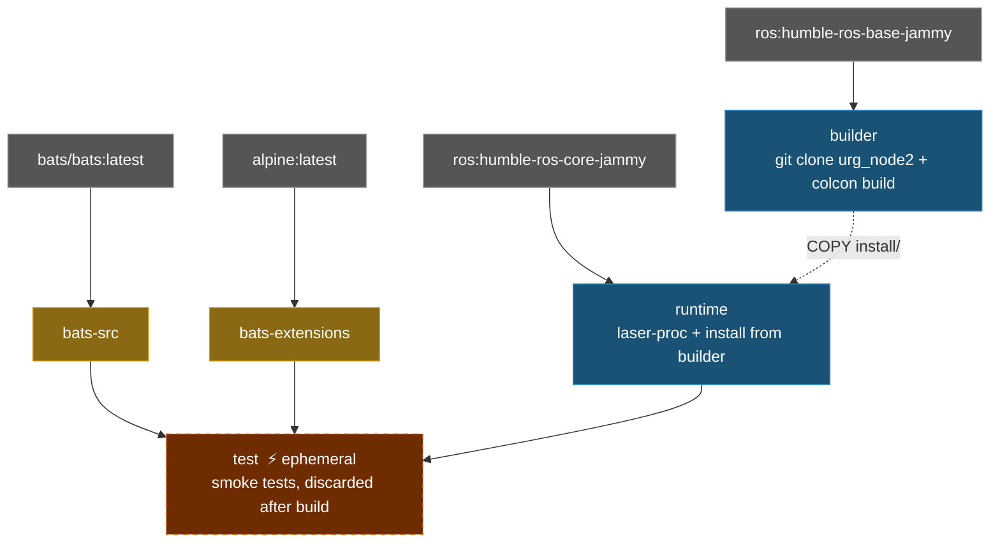

# Hokuyo URG Node2 Docker Environment

**[English](README.md)** | **[繁體中文](README.zh-TW.md)**

> **TL;DR** — Containerized Hokuyo LiDAR driver for ROS 2 Humble. Builds `urg_node2` from source, includes pre-configured parameter files for Ethernet and serial connections.
>
> ```bash
> ./build.sh && ./run.sh
> ```

---

## Table of Contents

- [Features](#features)
- [Quick Start](#quick-start)
- [Usage](#usage)
- [Configuration](#configuration)
- [Architecture](#architecture)
- [Directory Structure](#directory-structure)

---

## Features

- **Source build**: clones and builds [urg_node2](https://github.com/Hokuyo-aut/urg_node2) from source
- **Multi-stage build**: builder (compile) → runtime (minimal), keeps image small
- **Smoke Test**: Bats tests verify ROS environment, package availability, and config files
- **Pre-configured**: includes Ethernet and serial parameter files for Hokuyo LiDARs
- **Docker Compose**: single `compose.yaml` for build and run

## Quick Start

```bash
# 1. Build
./build.sh

# 2. Run (requires Hokuyo LiDAR connected)
./run.sh

# 3. Enter running container
./exec.sh
```

## Usage

### Build

```bash
./build.sh                       # Build runtime (default)
./build.sh test                  # Build with smoke tests

docker compose build runtime     # Equivalent
```

### Run

```bash
# Run with default launch file
./run.sh

# Run with custom command
docker compose run --rm runtime ros2 launch urg_node2 urg_node2.launch.py

# Enter running container
./exec.sh
```

## Configuration

### Parameter Files

Located in `config/`:

| File | Connection | Description |
|------|-----------|-------------|
| `params_ether.yaml` | Ethernet | Default IP `192.168.1.10`, port `10940` |
| `params_ether_2nd.yaml` | Ethernet | Second LiDAR, IP `192.168.0.11` |
| `params_serial.yaml` | Serial | `/dev/ttyACM0`, baud `115200` |

### Key Parameters

| Parameter | Description | Default |
|-----------|-------------|---------|
| `ip_address` | LiDAR IP (Ethernet mode) | `192.168.1.10` |
| `ip_port` | LiDAR port | `10940` |
| `serial_port` | Serial device (serial mode) | `/dev/ttyACM0` |
| `frame_id` | TF frame name | `laser` |
| `angle_min` / `angle_max` | Scan angle range (rad) | `-3.14` / `3.14` |
| `publish_intensity` | Publish intensity data | `true` |

## Architecture

### Docker Build Stage Diagram



### Stage Description

| Stage | FROM | Purpose |
|-------|------|---------|
| `bats-src` | `bats/bats:latest` | Bats binary source, not shipped |
| `bats-extensions` | `alpine:latest` | bats-support, bats-assert, not shipped |
| `builder` | `ros:humble-ros-base-jammy` | Clone + build urg_node2 from source |
| `runtime` | `ros:humble-ros-core-jammy` | Minimal runtime with built package + laser-proc |
| `test` | `runtime` | Smoke tests, discarded after build |

## Smoke Tests

```bash
./build.sh test
```

Located in `smoke_test/ros_env.bats` — **9 tests** total.

<details>
<summary>Click to expand test details</summary>

#### ROS environment (3)

| Test | Description |
|------|-------------|
| `ROS_DISTRO` | Is set |
| `setup.bash` | File exists |
| `setup.bash` | Can be sourced |

#### urg_node2 package (4)

| Test | Description |
|------|-------------|
| Workspace install | Directory exists |
| `local_setup.sh` | File exists |
| `urg_node2` | Package available via `ros2 pkg list` |
| Config files | Exist in install directory |

#### Dependencies (1)

| Test | Description |
|------|-------------|
| `laser_proc` | Package available |

#### System (1)

| Test | Description |
|------|-------------|
| `entrypoint.sh` | Exists and executable |

</details>

## Directory Structure

```text
urg_node2/
├── compose.yaml                 # Docker Compose definition
├── Dockerfile                   # Multi-stage build (builder + runtime + test)
├── build.sh                     # Build script
├── run.sh                       # Run script
├── exec.sh                      # Enter running container
├── entrypoint.sh                # Sources ROS 2 + workspace
├── config/                      # Hokuyo parameter files
│   ├── params_ether.yaml        # Ethernet connection
│   ├── params_ether_2nd.yaml    # Second LiDAR (Ethernet)
│   └── params_serial.yaml       # Serial connection
├── .github/workflows/           # CI/CD
│   ├── main.yaml
│   ├── build-worker.yaml
│   └── release-worker.yaml
└── smoke_test/                  # Bats environment tests
    ├── ros_env.bats
    └── test_helper.bash
```
