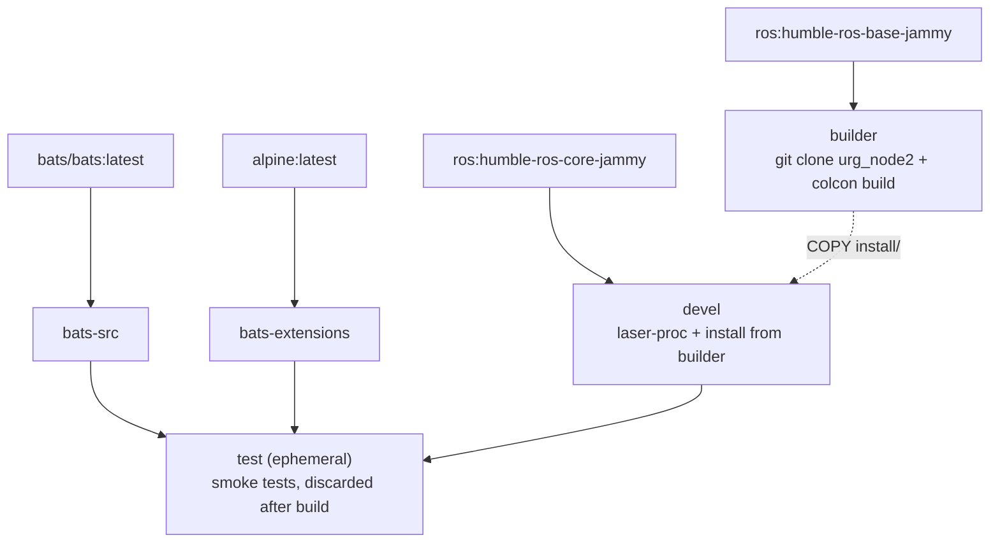

# Hokuyo URG Node Humble Docker Environment

**[English](README.md)** | **[繁體中文](doc/README.zh-TW.md)** | **[简体中文](doc/README.zh-CN.md)** | **[日本語](doc/README.ja.md)**

> **TL;DR** — Containerized Hokuyo LiDAR driver for ROS 2 Humble. Builds `urg_node2` from source, includes pre-configured parameter files for Ethernet and serial connections.
>
> ```bash
> ./build.sh && ./run.sh
> ```

---

## Table of Contents

- [Features](#features)
- [Quick Start](#quick-start)
- [Usage](#usage)
- [Configuration](#configuration)
- [Architecture](#architecture)
- [Directory Structure](#directory-structure)

---

## Features

- **Source build**: clones and builds [urg_node2](https://github.com/Hokuyo-aut/urg_node2) from source
- **Multi-stage build**: builder (compile) → devel (minimal), keeps image small
- **Smoke Test**: Bats tests verify ROS environment, package availability, and config files
- **Pre-configured**: includes Ethernet and serial parameter files for Hokuyo LiDARs
- **Docker Compose**: single `compose.yaml` for build and run

## Quick Start

```bash
# 1. Build
./build.sh

# 2. Run (requires Hokuyo LiDAR connected)
./run.sh

# 3. Enter running container
./exec.sh
```

## Usage

### Build

```bash
./build.sh                       # Build devel (default)
./build.sh test                  # Build with smoke tests

docker compose build devel       # Equivalent
```

### Run

```bash
# Run with default launch file
./run.sh

# Run with custom command
docker compose run --rm devel ros2 launch urg_node2 urg_node2.launch.py

# Enter running container
./exec.sh
```

## Configuration

### Parameter Files

Located in `config/`:

| File | Connection | Description |
|------|-----------|-------------|
| `params_ether.yaml` | Ethernet | Default IP `192.168.1.10`, port `10940` |
| `params_ether_2nd.yaml` | Ethernet | Second LiDAR, IP `192.168.0.11` |
| `params_serial.yaml` | Serial | `/dev/ttyACM0`, baud `115200` |

### Key Parameters

| Parameter | Description | Default |
|-----------|-------------|---------|
| `ip_address` | LiDAR IP (Ethernet mode) | `192.168.1.10` |
| `ip_port` | LiDAR port | `10940` |
| `serial_port` | Serial device (serial mode) | `/dev/ttyACM0` |
| `frame_id` | TF frame name | `laser` |
| `angle_min` / `angle_max` | Scan angle range (rad) | `-3.14` / `3.14` |
| `publish_intensity` | Publish intensity data | `true` |

## Architecture

### Docker Build Stage Diagram



### Stage Description

| Stage | FROM | Purpose |
|-------|------|---------|
| `bats-src` | `bats/bats:latest` | Bats binary source, not shipped |
| `bats-extensions` | `alpine:latest` | bats-support, bats-assert, not shipped |
| `builder` | `ros:humble-ros-base-jammy` | Clone + build urg_node2 from source |
| `devel` | `ros:humble-ros-core-jammy` | Minimal runtime with built package + laser-proc |
| `test` | `devel` | Smoke tests, discarded after build |

## Smoke Tests

See [TEST.md](doc/test/TEST.md) for details.

## Directory Structure

```text
urg_node_humble/
├── compose.yaml                 # Docker Compose definition
├── Dockerfile                   # Multi-stage build (builder + devel + test)
├── build.sh -> template/build.sh    # Symlink
├── run.sh -> template/run.sh        # Symlink
├── exec.sh -> template/exec.sh      # Symlink
├── stop.sh -> template/stop.sh      # Symlink
├── Makefile -> template/Makefile    # Symlink
├── .template_version            # Template subtree version (v0.4.1)
├── .hadolint.yaml               # Custom Hadolint rules
├── script/
│   └── entrypoint.sh            # Sources ROS 2 + workspace
├── config/                      # Hokuyo parameter files
│   ├── params_ether.yaml        # Ethernet connection
│   ├── params_ether_2nd.yaml    # Second LiDAR (Ethernet)
│   └── params_serial.yaml       # Serial connection
├── template/                    # Shared template (git subtree)
├── doc/                         # Translated READMEs
│   ├── README.zh-TW.md          # Traditional Chinese
│   ├── README.zh-CN.md          # Simplified Chinese
│   └── README.ja.md             # Japanese
├── .github/workflows/
│   └── main.yaml                # CI/CD (calls template reusable workflows)
└── test/smoke/                  # Bats environment tests (repo-specific)
    └── ros_env.bats
```
