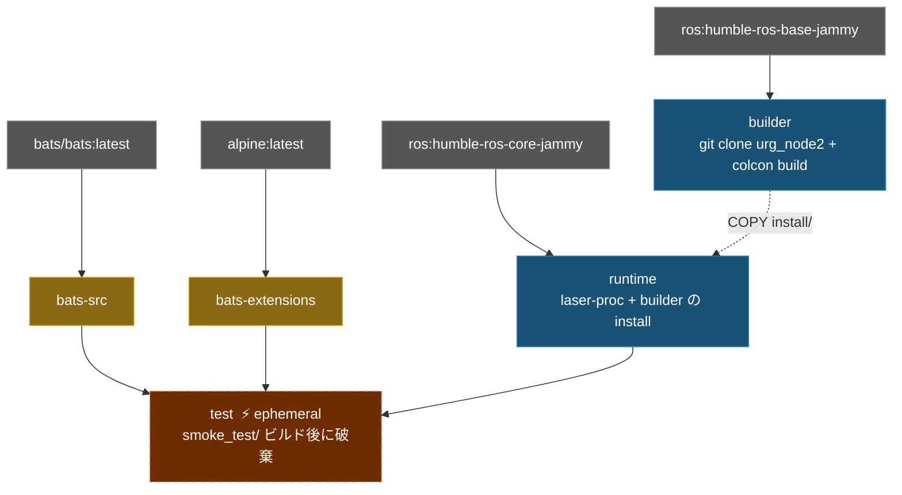

# Hokuyo URG Node Humble Docker Environment

**[English](../README.md)** | **[繁體中文](README.zh-TW.md)** | **[简体中文](README.zh-CN.md)** | **[日本語](README.ja.md)**

> **TL;DR** — コンテナ化された Hokuyo LiDAR ドライバ、ROS 2 Humble ベース。ソースから `urg_node2` をビルドし、Ethernet および Serial 接続のデフォルトパラメータファイルを同梱。
>
> ```bash
> ./build.sh && ./run.sh
> ```

---

## 目次

- [特徴](#特徴)
- [クイックスタート](#クイックスタート)
- [使い方](#使い方)
- [設定](#設定)
- [アーキテクチャ](#アーキテクチャ)
- [ディレクトリ構成](#ディレクトリ構成)

---

## 特徴

- **ソースからビルド**：[urg_node2](https://github.com/Hokuyo-aut/urg_node2) をクローンしてビルド
- **マルチステージビルド**：builder（コンパイル）→ runtime（最小化）、イメージサイズを削減
- **Smoke Test**：Bats テストで ROS 環境、パッケージの可用性、設定ファイルを検証
- **デフォルト設定**：Hokuyo LiDAR の Ethernet・Serial パラメータファイルを同梱
- **Docker Compose**：`compose.yaml` 一つでビルドと実行を管理

## クイックスタート

```bash
# 1. ビルド
./build.sh

# 2. 実行（Hokuyo LiDAR の接続が必要）
./run.sh

# 3. 起動中のコンテナに接続
./exec.sh
```

## 使い方

### ビルド

```bash
./build.sh                       # runtime をビルド（デフォルト）
./build.sh test                  # smoke test 付きビルド

docker compose build runtime     # 同等のコマンド
```

### 実行

```bash
# デフォルトの launch file で実行
./run.sh

# カスタムコマンド
docker compose run --rm runtime ros2 launch urg_node2 urg_node2.launch.py

# 起動中のコンテナに接続
./exec.sh
```

## 設定

### パラメータファイル

`config/` 内：

| ファイル | 接続方式 | 説明 |
|----------|---------|------|
| `params_ether.yaml` | Ethernet | デフォルト IP `192.168.1.10`、port `10940` |
| `params_ether_2nd.yaml` | Ethernet | 2台目の LiDAR、IP `192.168.0.11` |
| `params_serial.yaml` | Serial | `/dev/ttyACM0`、baud `115200` |

### 主要パラメータ

| パラメータ | 説明 | デフォルト値 |
|-----------|------|-------------|
| `ip_address` | LiDAR IP（Ethernet モード） | `192.168.1.10` |
| `ip_port` | LiDAR ポート | `10940` |
| `serial_port` | シリアルデバイス（Serial モード） | `/dev/ttyACM0` |
| `frame_id` | TF フレーム名 | `laser` |
| `angle_min` / `angle_max` | スキャン角度範囲（rad） | `-3.14` / `3.14` |
| `publish_intensity` | 強度データを配信 | `true` |

## アーキテクチャ

### Docker Build Stage 関係図



### Stage 説明

| Stage | FROM | 用途 |
|-------|------|------|
| `bats-src` | `bats/bats:latest` | bats バイナリソース、出荷しない |
| `bats-extensions` | `alpine:latest` | bats-support、bats-assert、出荷しない |
| `builder` | `ros:humble-ros-base-jammy` | urg_node2 をクローン + ビルド |
| `runtime` | `ros:humble-ros-core-jammy` | 最小化 runtime、ビルド済みパッケージ + laser-proc |
| `test` | `runtime` | Smoke test、ビルド後に破棄 |

## Smoke Tests

```bash
./build.sh test
```

`test/smoke_test/` — **21 テスト**。

<details>
<summary>クリックしてテスト詳細を表示</summary>

#### ROS 環境 (3)

| テスト項目 | 説明 |
|-----------|------|
| `ROS_DISTRO` | 設定済み |
| `setup.bash` | ファイルが存在する |
| `setup.bash` | source 可能 |

#### urg_node2 パッケージ (4)

| テスト項目 | 説明 |
|-----------|------|
| workspace install | ディレクトリが存在する |
| `local_setup.sh` | ファイルが存在する |
| `urg_node2` | `ros2 pkg list` で検出可能 |
| 設定ファイル | install ディレクトリ内に存在する |

#### 依存関係 (1)

| テスト項目 | 説明 |
|-----------|------|
| `laser_proc` | パッケージが利用可能 |

#### システム (1)

| テスト項目 | 説明 |
|-----------|------|
| `entrypoint.sh` | 存在し実行可能 |

#### スクリプト help (12)

| テスト項目 | 説明 |
|-----------|------|
| `build.sh -h` | 終了コード 0 |
| `build.sh --help` | 終了コード 0 |
| `build.sh -h` | usage を表示 |
| `run.sh -h` | 終了コード 0 |
| `run.sh --help` | 終了コード 0 |
| `run.sh -h` | usage を表示 |
| `exec.sh -h` | 終了コード 0 |
| `exec.sh --help` | 終了コード 0 |
| `exec.sh -h` | usage を表示 |
| `stop.sh -h` | 終了コード 0 |
| `stop.sh --help` | 終了コード 0 |
| `stop.sh -h` | usage を表示 |

</details>

## ディレクトリ構成

```text
urg_node_humble/
├── compose.yaml                 # Docker Compose 定義
├── Dockerfile                   # マルチステージビルド（builder + runtime + test）
├── build.sh                     # ビルドスクリプト
├── run.sh                       # 実行スクリプト
├── exec.sh                      # 起動中のコンテナに接続
├── stop.sh                      # コンテナを停止
├── script/
│   └── entrypoint.sh            # ROS 2 + workspace を source
├── config/                      # Hokuyo パラメータファイル
│   ├── params_ether.yaml        # Ethernet 接続
│   ├── params_ether_2nd.yaml    # 2台目の LiDAR（Ethernet）
│   └── params_serial.yaml       # Serial 接続
├── doc/                         # 翻訳版 README
│   ├── README.zh-TW.md          # 繁体字中国語
│   ├── README.zh-CN.md          # 簡体字中国語
│   └── README.ja.md             # 日本語
├── .github/workflows/           # CI/CD
│   ├── main.yaml
│   ├── build-worker.yaml
│   └── release-worker.yaml
└── test/smoke_test/             # Bats 環境テスト
    ├── ros_env.bats
    ├── script_help.bats
    └── test_helper.bash
```
