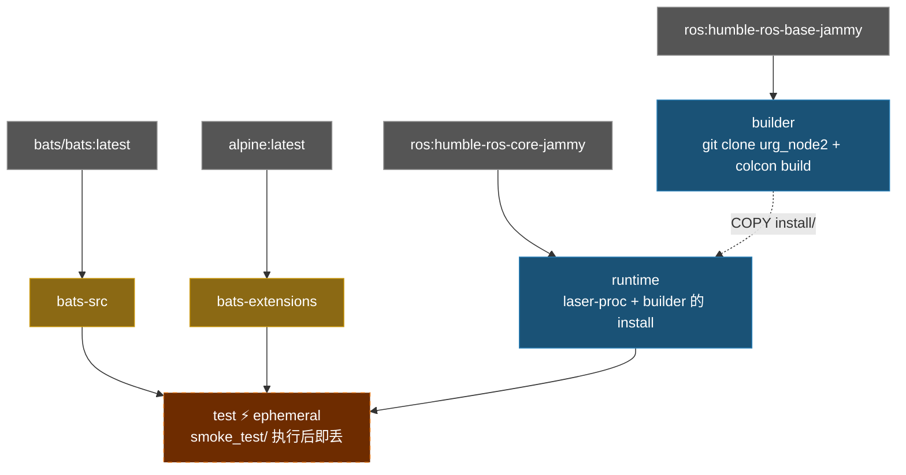

# Hokuyo URG Node Humble Docker Environment

**[English](../README.md)** | **[繁體中文](README.zh-TW.md)** | **[简体中文](README.zh-CN.md)** | **[日本語](README.ja.md)**

> **TL;DR** — 容器化的 Hokuyo LiDAR 驱动程序，基于 ROS 2 Humble。从 source 编译 `urg_node2`，内含 Ethernet 和 Serial 连接的默认参数文件。
>
> ```bash
> ./build.sh && ./run.sh
> ```

---

## 目录

- [特性](#特性)
- [快速开始](#快速开始)
- [使用方式](#使用方式)
- [设置](#设置)
- [架构](#架构)
- [目录结构](#目录结构)

---

## 特性

- **从 source 编译**：clone 并编译 [urg_node2](https://github.com/Hokuyo-aut/urg_node2)
- **多阶段构建**：builder（编译）→ runtime（最小化），镜像体积小
- **Smoke Test**：Bats 测试验证 ROS 环境、package 可用性及设置文件
- **默认设置**：内含 Hokuyo LiDAR 的 Ethernet 和 Serial 参数文件
- **Docker Compose**：一个 `compose.yaml` 管理构建与执行

## 快速开始

```bash
# 1. 构建
./build.sh

# 2. 执行（需要连接 Hokuyo LiDAR）
./run.sh

# 3. 进入已启动的容器
./exec.sh
```

## 使用方式

### 构建

```bash
./build.sh                       # 构建 runtime（默认）
./build.sh test                  # 构建含 smoke test

docker compose build runtime     # 等效命令
```

### 执行

```bash
# 以默认 launch file 执行
./run.sh

# 自定义命令
docker compose run --rm runtime ros2 launch urg_node2 urg_node2.launch.py

# 进入已启动的容器
./exec.sh
```

## 设置

### 参数文件

位于 `config/`：

| 文件 | 连接方式 | 说明 |
|------|---------|------|
| `params_ether.yaml` | Ethernet | 默认 IP `192.168.1.10`，port `10940` |
| `params_ether_2nd.yaml` | Ethernet | 第二颗 LiDAR，IP `192.168.0.11` |
| `params_serial.yaml` | Serial | `/dev/ttyACM0`，baud `115200` |

### 主要参数

| 参数 | 说明 | 默认值 |
|------|------|--------|
| `ip_address` | LiDAR IP（Ethernet 模式） | `192.168.1.10` |
| `ip_port` | LiDAR port | `10940` |
| `serial_port` | Serial 设备（Serial 模式） | `/dev/ttyACM0` |
| `frame_id` | TF frame 名称 | `laser` |
| `angle_min` / `angle_max` | 扫描角度范围（rad） | `-3.14` / `3.14` |
| `publish_intensity` | 发布强度数据 | `true` |

## 架构

### Docker Build Stage 关系图



### Stage 说明

| Stage | FROM | 用途 |
|-------|------|------|
| `bats-src` | `bats/bats:latest` | bats 二进制来源，不出货 |
| `bats-extensions` | `alpine:latest` | bats-support、bats-assert，不出货 |
| `builder` | `ros:humble-ros-base-jammy` | Clone + 编译 urg_node2 |
| `runtime` | `ros:humble-ros-core-jammy` | 最小化 runtime，含编译好的 package + laser-proc |
| `test` | `runtime` | Smoke test，build 完即丢 |

## Smoke Tests

```bash
./build.sh test
```

位于 `test/smoke_test/`，共 **21** 项。

<details>
<summary>展开查看测试详情</summary>

#### ROS 环境 (3)

| 测试项目 | 说明 |
|----------|------|
| `ROS_DISTRO` | 已设置 |
| `setup.bash` | 文件存在 |
| `setup.bash` | 可 source |

#### urg_node2 套件 (4)

| 测试项目 | 说明 |
|----------|------|
| workspace install | 目录存在 |
| `local_setup.sh` | 文件存在 |
| `urg_node2` | 通过 `ros2 pkg list` 可找到 |
| 设置文件 | install 目录中存在 |

#### 依赖 (1)

| 测试项目 | 说明 |
|----------|------|
| `laser_proc` | package 可用 |

#### 系统 (1)

| 测试项目 | 说明 |
|----------|------|
| `entrypoint.sh` | 存在且可执行 |

#### 脚本 help (12)

| 测试项目 | 说明 |
|----------|------|
| `build.sh -h` | 退出码 0 |
| `build.sh --help` | 退出码 0 |
| `build.sh -h` | 显示 usage |
| `run.sh -h` | 退出码 0 |
| `run.sh --help` | 退出码 0 |
| `run.sh -h` | 显示 usage |
| `exec.sh -h` | 退出码 0 |
| `exec.sh --help` | 退出码 0 |
| `exec.sh -h` | 显示 usage |
| `stop.sh -h` | 退出码 0 |
| `stop.sh --help` | 退出码 0 |
| `stop.sh -h` | 显示 usage |

</details>

## 目录结构

```text
urg_node_humble/
├── compose.yaml                 # Docker Compose 定义
├── Dockerfile                   # 多阶段构建（builder + runtime + test）
├── build.sh                     # 构建脚本
├── run.sh                       # 执行脚本
├── exec.sh                      # 进入已启动的容器
├── stop.sh                      # 停止容器
├── script/
│   └── entrypoint.sh            # Source ROS 2 + workspace
├── config/                      # Hokuyo 参数文件
│   ├── params_ether.yaml        # Ethernet 连接
│   ├── params_ether_2nd.yaml    # 第二颗 LiDAR（Ethernet）
│   └── params_serial.yaml       # Serial 连接
├── doc/                         # 翻译版 README
│   ├── README.zh-TW.md          # 繁体中文
│   ├── README.zh-CN.md          # 简体中文
│   └── README.ja.md             # 日文
├── .github/workflows/           # CI/CD
│   ├── main.yaml
│   ├── build-worker.yaml
│   └── release-worker.yaml
└── test/smoke_test/             # Bats 环境测试
    ├── ros_env.bats
    ├── script_help.bats
    └── test_helper.bash
```
