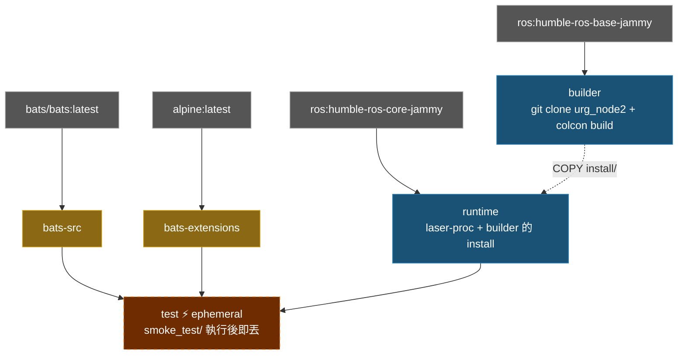

# Hokuyo URG Node2 Docker Environment

**[English](../README.md)** | **[繁體中文](README.zh-TW.md)** | **[简体中文](README.zh-CN.md)** | **[日本語](README.ja.md)**

> **TL;DR** — 容器化的 Hokuyo LiDAR 驅動程式，基於 ROS 2 Humble。從 source 編譯 `urg_node2`，內含 Ethernet 和 Serial 連線的預設參數檔。
>
> ```bash
> ./build.sh && ./run.sh
> ```

---

## 目錄

- [特色](#特色)
- [快速開始](#快速開始)
- [使用方式](#使用方式)
- [設定](#設定)
- [架構](#架構)
- [目錄結構](#目錄結構)

---

## 特色

- **從 source 編譯**：clone 並編譯 [urg_node2](https://github.com/Hokuyo-aut/urg_node2)
- **多階段建置**：builder（編譯）→ runtime（最小化），映像體積小
- **Smoke Test**：Bats 測試驗證 ROS 環境、package 可用性及設定檔
- **預設設定**：內含 Hokuyo LiDAR 的 Ethernet 和 Serial 參數檔
- **Docker Compose**：一個 `compose.yaml` 管理建置與執行

## 快速開始

```bash
# 1. 建置
./build.sh

# 2. 執行（需要連接 Hokuyo LiDAR）
./run.sh

# 3. 進入已啟動的容器
./exec.sh
```

## 使用方式

### 建置

```bash
./build.sh                       # 建置 runtime（預設）
./build.sh test                  # 建置含 smoke test

docker compose build runtime     # 等效指令
```

### 執行

```bash
# 以預設 launch file 執行
./run.sh

# 自定義指令
docker compose run --rm runtime ros2 launch urg_node2 urg_node2.launch.py

# 進入已啟動的容器
./exec.sh
```

## 設定

### 參數檔

位於 `config/`：

| 檔案 | 連線方式 | 說明 |
|------|---------|------|
| `params_ether.yaml` | Ethernet | 預設 IP `192.168.1.10`，port `10940` |
| `params_ether_2nd.yaml` | Ethernet | 第二顆 LiDAR，IP `192.168.0.11` |
| `params_serial.yaml` | Serial | `/dev/ttyACM0`，baud `115200` |

### 主要參數

| 參數 | 說明 | 預設值 |
|------|------|--------|
| `ip_address` | LiDAR IP（Ethernet 模式） | `192.168.1.10` |
| `ip_port` | LiDAR port | `10940` |
| `serial_port` | Serial 裝置（Serial 模式） | `/dev/ttyACM0` |
| `frame_id` | TF frame 名稱 | `laser` |
| `angle_min` / `angle_max` | 掃描角度範圍（rad） | `-3.14` / `3.14` |
| `publish_intensity` | 發佈強度資料 | `true` |

## 架構

### Docker Build Stage 關係圖



### Stage 說明

| Stage | FROM | 用途 |
|-------|------|------|
| `bats-src` | `bats/bats:latest` | bats 二進位來源，不出貨 |
| `bats-extensions` | `alpine:latest` | bats-support、bats-assert，不出貨 |
| `builder` | `ros:humble-ros-base-jammy` | Clone + 編譯 urg_node2 |
| `runtime` | `ros:humble-ros-core-jammy` | 最小化 runtime，含編譯好的 package + laser-proc |
| `test` | `runtime` | Smoke test，build 完即丟 |

## Smoke Tests

```bash
./build.sh test
```

位於 `test/smoke_test/`，共 **21** 項。

<details>
<summary>展開查看測試細項</summary>

#### ROS 環境 (3)

| 測試項目 | 說明 |
|----------|------|
| `ROS_DISTRO` | 已設定 |
| `setup.bash` | 檔案存在 |
| `setup.bash` | 可 source |

#### urg_node2 套件 (4)

| 測試項目 | 說明 |
|----------|------|
| workspace install | 目錄存在 |
| `local_setup.sh` | 檔案存在 |
| `urg_node2` | 透過 `ros2 pkg list` 可找到 |
| 設定檔 | install 目錄中存在 |

#### 依賴 (1)

| 測試項目 | 說明 |
|----------|------|
| `laser_proc` | package 可用 |

#### 系統 (1)

| 測試項目 | 說明 |
|----------|------|
| `entrypoint.sh` | 存在且可執行 |

#### 腳本 help (12)

| 測試項目 | 說明 |
|----------|------|
| `build.sh -h` | 結束碼 0 |
| `build.sh --help` | 結束碼 0 |
| `build.sh -h` | 顯示 usage |
| `run.sh -h` | 結束碼 0 |
| `run.sh --help` | 結束碼 0 |
| `run.sh -h` | 顯示 usage |
| `exec.sh -h` | 結束碼 0 |
| `exec.sh --help` | 結束碼 0 |
| `exec.sh -h` | 顯示 usage |
| `stop.sh -h` | 結束碼 0 |
| `stop.sh --help` | 結束碼 0 |
| `stop.sh -h` | 顯示 usage |

</details>

## 目錄結構

```text
urg_node2/
├── compose.yaml                 # Docker Compose 定義
├── Dockerfile                   # 多階段建置（builder + runtime + test）
├── build.sh                     # 建置腳本
├── run.sh                       # 執行腳本
├── exec.sh                      # 進入已啟動的容器
├── stop.sh                      # 停止容器
├── script/
│   └── entrypoint.sh            # Source ROS 2 + workspace
├── config/                      # Hokuyo 參數檔
│   ├── params_ether.yaml        # Ethernet 連線
│   ├── params_ether_2nd.yaml    # 第二顆 LiDAR（Ethernet）
│   └── params_serial.yaml       # Serial 連線
├── doc/                         # 翻譯版 README
│   ├── README.zh-TW.md          # 繁體中文
│   ├── README.zh-CN.md          # 簡體中文
│   └── README.ja.md             # 日文
├── .github/workflows/           # CI/CD
│   ├── main.yaml
│   ├── build-worker.yaml
│   └── release-worker.yaml
└── test/smoke_test/             # Bats 環境測試
    ├── ros_env.bats
    ├── script_help.bats
    └── test_helper.bash
```
