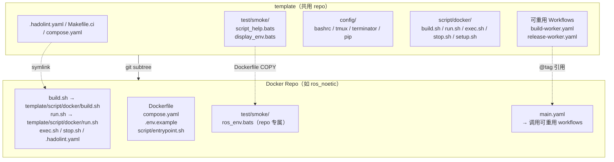
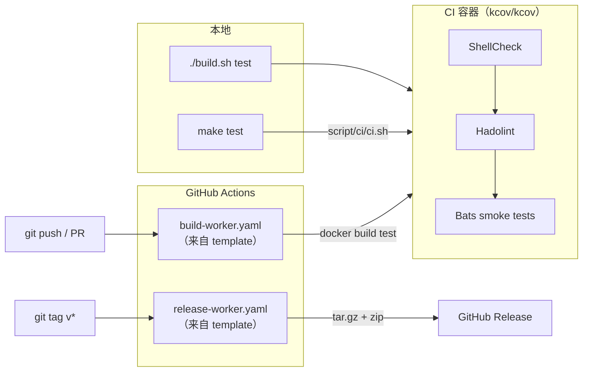

# template

[](https://github.com/ycpss91255-docker/template/actions/workflows/self-test.yaml)
[](https://codecov.io/gh/ycpss91255-docker/template)


[](./LICENSE)

[ycpss91255-docker](https://github.com/ycpss91255-docker) 组织下所有 Docker 容器 repo 的共用模板。

**[English](../../README.md)** | **[繁體中文](README.zh-TW.md)** | **[简体中文](README.zh-CN.md)** | **[日本語](README.ja.md)**

---

## 目录

- [TL;DR](#tldr)
- [概述](#概述)
- [快速开始](#快速开始)
- [CI Reusable Workflows](#ci-reusable-workflows)
- [本地运行测试](#本地运行测试)
- [测试](#测试)
- [目录结构](#目录结构)

---

## TL;DR

```bash
# 新 repo：添加 subtree + 初始化
git subtree add --prefix=template \
    git@github.com:ycpss91255-docker/template.git main --squash
./template/init.sh

# 升级到最新版
make upgrade-check   # 检查
make upgrade         # pull + 更新版本文件 + workflow tag

# 运行 CI
make test            # ShellCheck + Bats + Kcov
make help            # 显示所有命令
```

## 概述

此 repo 集中管理所有 Docker 容器 repo 共用的脚本、测试和 CI workflow。各 repo 通过 **git subtree** 拉入此模板，并使用 symlink 引用共用文件。

### 架构



### CI/CD 流程



### 包含内容

| 文件 | 说明 |
|------|------|
| `build.sh` | 构建容器（调用 `script/docker/setup.sh` 生成 `.env`） |
| `run.sh` | 运行容器（支持 X11/Wayland） |
| `exec.sh` | 进入运行中的容器 |
| `stop.sh` | 停止并移除容器 |
| `script/docker/setup.sh` | 自动检测系统参数并生成 `.env` |
| `script/docker/_lib.sh` | 共用 helper（`_load_env`、`_compose`、`_compose_project` 等） |
| `script/docker/i18n.sh` | 共用语言检测（`_detect_lang`、`_LANG`） |
| `config/` | Shell 配置文件（bashrc、tmux、terminator、pip）+ IMAGE_NAME 规则 |
| `test/smoke/` | 共用 smoke 测试 + runtime assertion helpers（见下方） |
| `test/unit/` | Template 自身测试（bats + kcov） |
| `test/integration/` | Level-1 `init.sh` 集成测试 |
| `.hadolint.yaml` | 共用 Hadolint 规则 |
| `Makefile` | Repo 命令入口（`make build`、`make run`、`make stop` 等） |
| `Makefile.ci` | Template CI 命令入口（`make test`、`make lint` 等） |
| `init.sh` | 首次初始化 symlinks + 新 repo 骨架生成 |
| `upgrade.sh` | Subtree 版本升级 |
| `script/ci/ci.sh` | CI pipeline（本地 + 远端） |
| `dockerfile/Dockerfile.example` | 新 repo 的多阶段 Dockerfile 模板 |
| `dockerfile/Dockerfile.test-tools` | 预构建 lint/test 工具 image（shellcheck、hadolint、bats、bats-mock） |
| `.github/workflows/` | 可重用 CI workflows（build + release） |

### Dockerfile 分层（约定）

下游 repo 遵循标准多阶段配置，定义于 `dockerfile/Dockerfile.example`。
所有阶段共用 `ARG BASE_IMAGE` 指定的基础镜像。

| 阶段 | 父阶段 | 用途 | 是否出货 |
|------|--------|------|---------|
| `sys` | `${BASE_IMAGE}` | 用户/用户组、sudo、时区、语系、APT mirror | 中间 |
| `base` | `sys` | 开发工具与语言套件 | 中间 |
| `devel` | `base` | 应用专属工具 + `entrypoint.sh` + PlotJuggler（env repos） | **是**（主要产物） |
| `test` | `devel` | 短暂：ShellCheck + Hadolint + Bats smoke（均来自 `test-tools:local`） | 否（build 完即丢） |
| `runtime-base`（可选） | `sys` | 最小 runtime 依赖（sudo、tini） | 中间 |
| `runtime`（可选） | `runtime-base` | 精简 runtime 镜像（application repos 使用） | 启用时出货 |

说明：
- 只出货 developer image 的 repo（`env/*`）会跳过 `runtime-base` /
  `runtime`——该 section 在 `Dockerfile.example` 保持注释状态。
- `test` 总是从 `devel` 继承，所以 `test/smoke/<repo>_env.bats` 中的
  runtime assertion 所看到的二进制与文件，就是用户 `docker run ...
  <repo>:devel` 后会看到的内容。
- `Dockerfile.test-tools` 另外构建一个 `test-tools:local` image（不在
  上面的阶段链中），`test` 阶段通过 `COPY --from=test-tools:local`
  把 bats / shellcheck / hadolint 二进制拉进来。

### Smoke test helpers（供下游 repo 使用）

`test/smoke/test_helper.bash`（每个 smoke spec 通过
`load "${BATS_TEST_DIRNAME}/test_helper"` 加载）提供一组 runtime
assertion helpers。下游 repo 应优先使用这些 helper 而非原生的
`[ -f ... ]` / `command -v`，失败时会输出 decorated 诊断信息直指缺少
的工件。

| Helper | 用法 |
|--------|------|
| `assert_cmd_installed <cmd>` | `<cmd>` 不在 `PATH` 上时失败 |
| `assert_cmd_runs <cmd> [flag]` | `<cmd> <flag>` 非 0 时失败（flag 默认 `--version`） |
| `assert_file_exists <path>` | `<path>` 非 regular file 时失败 |
| `assert_dir_exists <path>` | `<path>` 非目录时失败 |
| `assert_file_owned_by <user> <path>` | `<path>` 所有者不是 `<user>` 时失败 |
| `assert_pip_pkg <pkg>` | `pip show <pkg>` 非 0 时失败 |

### 各 repo 自行维护的文件（不共用）

- `Dockerfile`
- `compose.yaml`
- `.env.example`
- `script/entrypoint.sh`
- `doc/` 和 `README.md`
- Repo 专属的 smoke test

## 快速开始

### 添加到新 repo

```bash
# 1. 添加 subtree
git subtree add --prefix=template \
    git@github.com:ycpss91255-docker/template.git main --squash

# 2. 初始化 symlinks（一个命令搞定）
./template/init.sh
```

### 升级

```bash
# 检查是否有新版
make upgrade-check

# 升级到最新（subtree pull + 版本文件 + workflow tag）
make upgrade

# 或指定版本
./template/upgrade.sh v0.3.0
```

## CI Reusable Workflows

各 repo 将本地的 `build-worker.yaml` / `release-worker.yaml` 替换为调用此 repo 的 reusable workflows：

```yaml
# .github/workflows/main.yaml
jobs:
  call-docker-build:
    uses: ycpss91255-docker/template/.github/workflows/build-worker.yaml@v1
    with:
      image_name: ros_noetic
      build_args: |
        ROS_DISTRO=noetic
        ROS_TAG=ros-base
        UBUNTU_CODENAME=focal

  call-release:
    needs: call-docker-build
    if: startsWith(github.ref, 'refs/tags/')
    uses: ycpss91255-docker/template/.github/workflows/release-worker.yaml@v1
    with:
      archive_name_prefix: ros_noetic
```

### build-worker.yaml 参数

| 参数 | 类型 | 必填 | 默认值 | 说明 |
|------|------|------|--------|------|
| `image_name` | string | 是 | - | 容器镜像名称 |
| `build_args` | string | 否 | `""` | 多行 KEY=VALUE 构建参数 |
| `build_runtime` | boolean | 否 | `true` | 是否构建 runtime stage |

### release-worker.yaml 参数

| 参数 | 类型 | 必填 | 默认值 | 说明 |
|------|------|------|--------|------|
| `archive_name_prefix` | string | 是 | - | Archive 名称前缀 |
| `extra_files` | string | 否 | `""` | 额外文件（空格分隔） |

## 本地运行测试

使用 `Makefile.ci`（在 template 根目录）：
```bash
make -f Makefile.ci test        # 完整 CI（ShellCheck + Bats + Kcov）通过 docker compose
make -f Makefile.ci lint        # 只运行 ShellCheck
make -f Makefile.ci clean       # 清除覆盖率报告
make help        # 显示 repo 命令
make -f Makefile.ci help  # 显示 CI 命令
```

或直接运行：
```bash
./script/ci/ci.sh          # 完整 CI（通过 docker compose）
./script/ci/ci.sh --ci     # 在容器内运行（由 compose 调用）
```

## 测试

详见 [TEST.md](../test/TEST.md)。

## 目录结构

```
template/
├── init.sh                           # 初始化 repo（新建或既有）
├── upgrade.sh                        # 升级 template subtree 版本
├── script/
│   ├── docker/                       # Docker 操作脚本（各 repo symlink）
│   │   ├── build.sh
│   │   ├── run.sh
│   │   ├── exec.sh
│   │   ├── stop.sh
│   │   ├── setup.sh                  # .env 生成器
│   │   ├── _lib.sh                   # 共用 helper（_load_env、_compose、_compose_project）
│   │   ├── i18n.sh                   # 共用语言检测（_detect_lang、_LANG）
│   │   └── Makefile
│   └── ci/
│       └── ci.sh                     # CI pipeline（本地 + 远端）
├── dockerfile/
│   ├── Dockerfile.test-tools         # 预构建 lint/测试工具 image
│   └── Dockerfile.example            # 新 repo 的 Dockerfile 模板（sys → base → devel → test → [runtime]）
├── config/                           # Shell/工具配置 + IMAGE_NAME 规则
│   ├── image_name.conf               # 默认 IMAGE_NAME 检测规则
│   ├── pip/
│   │   ├── setup.sh
│   │   └── requirements.txt
│   └── shell/
│       ├── bashrc
│       ├── terminator/
│       │   ├── setup.sh
│       │   └── config
│       └── tmux/
│           ├── setup.sh
│           └── tmux.conf
├── test/
│   ├── smoke/                        # 共用 smoke 测试 + runtime assertion helpers
│   │   ├── test_helper.bash          #  → assert_cmd_installed / _runs / file / dir / owned_by / pip_pkg
│   │   ├── script_help.bats
│   │   └── display_env.bats
│   ├── unit/                         # 模板自身测试（bats + kcov）
│   │   ├── test_helper.bash
│   │   ├── bashrc_spec.bats
│   │   ├── ci_spec.bats              # ci.sh _install_deps
│   │   ├── lib_spec.bats             # _lib.sh
│   │   ├── pip_setup_spec.bats
│   │   ├── setup_spec.bats
│   │   ├── smoke_helper_spec.bats    # Runtime assertion helpers
│   │   ├── template_spec.bats
│   │   ├── terminator_config_spec.bats
│   │   ├── terminator_setup_spec.bats
│   │   ├── tmux_conf_spec.bats
│   │   └── tmux_setup_spec.bats
│   └── integration/
│       └── init_new_repo_spec.bats   # Level-1 init.sh 集成测试
├── Makefile.ci                       # 模板 CI 入口（make test/lint/...）
├── compose.yaml                      # Docker CI 运行器
├── .hadolint.yaml                    # 共用 Hadolint 规则
├── codecov.yml
├── .github/workflows/
│   ├── self-test.yaml                # 模板 CI
│   ├── build-worker.yaml             # 可重用构建 workflow
│   └── release-worker.yaml           # 可重用发布 workflow
├── doc/
│   ├── readme/                       # README 翻译（zh-TW / zh-CN / ja）
│   ├── test/TEST.md                  # 测试清单
│   └── changelog/CHANGELOG.md        # 发布记录
├── .gitignore
├── LICENSE
└── README.md
```
