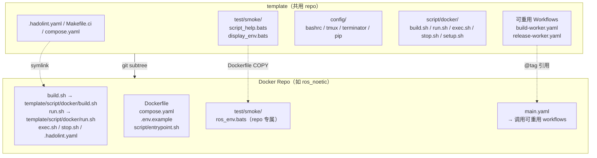
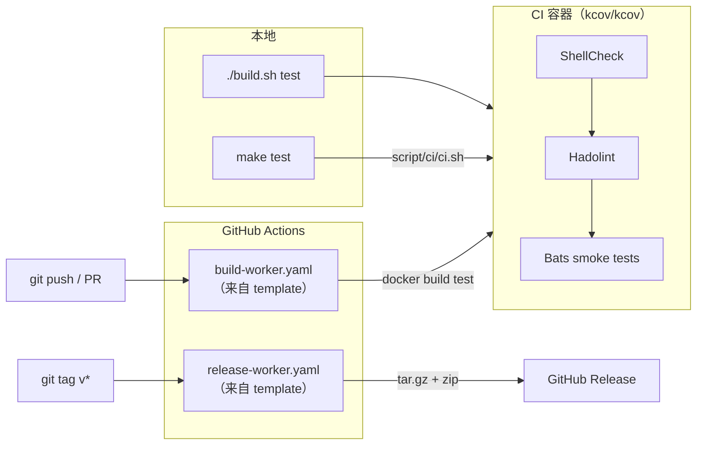

# template

[](https://github.com/ycpss91255-docker/template/actions/workflows/self-test.yaml)
[](https://codecov.io/gh/ycpss91255-docker/template)


[](./LICENSE)

[ycpss91255-docker](https://github.com/ycpss91255-docker) 组织下所有 Docker 容器 repo 的共用模板。

**[English](../../README.md)** | **[繁體中文](README.zh-TW.md)** | **[简体中文](README.zh-CN.md)** | **[日本語](README.ja.md)**

---

## 目录

- [TL;DR](#tldr)
- [概述](#概述)
- [快速开始](#快速开始)
- [CI Reusable Workflows](#ci-reusable-workflows)
- [本地运行测试](#本地运行测试)
- [测试](#测试)
- [目录结构](#目录结构)

---

## TL;DR

```bash
# 从零开始的新 repo：init + 首个 commit + subtree + init.sh
mkdir <repo_name> && cd <repo_name>
git init
git commit --allow-empty -m "chore: initial commit"
git subtree add --prefix=template \
    https://github.com/ycpss91255-docker/template.git main --squash
./template/init.sh

# 升级到最新版
make upgrade-check   # 检查
make upgrade         # pull + 更新版本文件 + workflow tag

# 运行 CI
make test            # ShellCheck + Bats + Kcov
make help            # 显示所有命令
```

## 概述

此 repo 集中管理所有 Docker 容器 repo 共用的脚本、测试和 CI workflow。各 repo 通过 **git subtree** 拉入此模板，并使用 symlink 引用共用文件。

### 架构



### CI/CD 流程



### 包含内容

| 文件 | 说明 |
|------|------|
| `build.sh` | 构建容器（`--setup` 有 TTY 时启动 `setup_tui.sh`，否则调用 `setup.sh`） |
| `run.sh` | 运行容器（支持 X11/Wayland；`--setup` 语义与 `build.sh` 相同） |
| `exec.sh` | 进入运行中的容器 |
| `stop.sh` | 停止并移除容器 |
| `setup_tui.sh` | 交互式 setup.conf 编辑器（dialog / whiptail 前端） |
| `script/docker/setup.sh` | 自动检测系统参数并生成 `.env` + `compose.yaml` |
| `script/docker/_tui_backend.sh` | `setup_tui.sh` 使用的 dialog / whiptail 包装函数 |
| `script/docker/_tui_conf.sh` | INI validator + 读写逻辑（供 `setup_tui.sh` 和 `setup.sh` 回写使用） |
| `script/docker/_lib.sh` | 共用 helper（`_load_env`、`_compose`、`_compose_project` 等） |
| `script/docker/i18n.sh` | 共用语言检测（`_detect_lang`、`_LANG`） |
| `config/` | Container 内部 shell 配置文件（bashrc、tmux、terminator、pip） |
| `setup.conf` | 单一 per-repo runtime 配置（image / build / deploy / gui / network / volumes） |
| `test/smoke/` | 共用 smoke 测试 + runtime assertion helpers（见下方） |
| `test/unit/` | Template 自身测试（bats + kcov） |
| `test/integration/` | Level-1 `init.sh` 集成测试 |
| `.hadolint.yaml` | 共用 Hadolint 规则 |
| `Makefile` | Repo 命令入口（`make build`、`make run`、`make stop` 等） |
| `Makefile.ci` | Template CI 命令入口（`make test`、`make lint` 等） |
| `init.sh` | 首次初始化 symlinks + 新 repo 骨架生成 |
| `upgrade.sh` | Subtree 版本升级 |
| `script/ci/ci.sh` | CI pipeline（本地 + 远端） |
| `dockerfile/Dockerfile.example` | 新 repo 的多阶段 Dockerfile 模板 |
| `dockerfile/Dockerfile.test-tools` | 预构建 lint/test 工具 image（shellcheck、hadolint、bats、bats-mock） |
| `.github/workflows/` | 可重用 CI workflows（build + release） |

### Dockerfile 分层（约定）

下游 repo 遵循标准多阶段配置，定义于 `dockerfile/Dockerfile.example`。
所有阶段共用 `ARG BASE_IMAGE` 指定的基础镜像。

| 阶段 | 父阶段 | 用途 | 是否出货 |
|------|--------|------|---------|
| `sys` | `${BASE_IMAGE}` | 用户/用户组、sudo、时区、语系、APT mirror | 中间 |
| `base` | `sys` | 开发工具与语言套件 | 中间 |
| `devel` | `base` | 应用专属工具 + `entrypoint.sh` + PlotJuggler（env repos） | **是**（主要产物） |
| `test` | `devel` | 短暂：ShellCheck + Hadolint + Bats smoke（均来自 `test-tools:local`） | 否（build 完即丢） |
| `runtime-base`（可选） | `sys` | 最小 runtime 依赖（sudo、tini） | 中间 |
| `runtime`（可选） | `runtime-base` | 精简 runtime 镜像（application repos 使用） | 启用时出货 |

说明：
- 只出货 developer image 的 repo（`env/*`）会跳过 `runtime-base` /
  `runtime`——该 section 在 `Dockerfile.example` 保持注释状态。
- `test` 总是从 `devel` 继承，所以 `test/smoke/<repo>_env.bats` 中的
  runtime assertion 所看到的二进制与文件，就是用户 `docker run ...
  <repo>:devel` 后会看到的内容。
- `Dockerfile.test-tools` 构建 lint/test 工具集（bats + shellcheck + hadolint）。下游 `test` 阶段通过 `ARG TEST_TOOLS_IMAGE` build arg 引用 — 默认 `test-tools:local`（对应本地 `./build.sh` 流程,把 `Dockerfile.test-tools` 构建到 host Docker daemon）。CI 则覆盖成 `ghcr.io/ycpss91255-docker/test-tools:vX.Y.Z`（由 `.github/workflows/release-test-tools.yaml` 在每次 tag 推的预构建 multi-arch image）,buildx 直接从 registry 拉对应架构的 bats / shellcheck / hadolint binary,避开 `docker-container` buildx driver 跨 step 不共享 image store 的问题。

### Smoke test helpers（供下游 repo 使用）

`test/smoke/test_helper.bash`（每个 smoke spec 通过
`load "${BATS_TEST_DIRNAME}/test_helper"` 加载）提供一组 runtime
assertion helpers。下游 repo 应优先使用这些 helper 而非原生的
`[ -f ... ]` / `command -v`，失败时会输出 decorated 诊断信息直指缺少
的工件。

| Helper | 用法 |
|--------|------|
| `assert_cmd_installed <cmd>` | `<cmd>` 不在 `PATH` 上时失败 |
| `assert_cmd_runs <cmd> [flag]` | `<cmd> <flag>` 非 0 时失败（flag 默认 `--version`） |
| `assert_file_exists <path>` | `<path>` 非 regular file 时失败 |
| `assert_dir_exists <path>` | `<path>` 非目录时失败 |
| `assert_file_owned_by <user> <path>` | `<path>` 所有者不是 `<user>` 时失败 |
| `assert_pip_pkg <pkg>` | `pip show <pkg>` 非 0 时失败 |

### 各 repo 自行维护的文件（不共用）

- `Dockerfile`
- `compose.yaml`
- `.env.example`
- `script/entrypoint.sh`
- `doc/` 和 `README.md`
- Repo 专属的 smoke test

## 各 repo runtime 配置

每个下游 repo 通过一个 `setup.conf` INI 文件驱动自己的 runtime 配置
（GPU 保留、GUI env/volumes、network mode、额外 volume mounts）。
`setup.sh` 读它 + 系统检测后重新生成 `.env` 和 `compose.yaml`，这两
个衍生文件用户不用动手编辑。

### 单一 conf、6 个 section

```
[image]    rules = prefix:docker_, suffix:_ws, @default:unknown
[build]    apt_mirror_ubuntu、apt_mirror_debian            # Dockerfile build args
[deploy]   gpu_mode (auto|force|off)、gpu_count、gpu_capabilities
[gui]      mode (auto|force|off)
[network]  mode (host|bridge|none)、ipc、privileged
[volumes]  mount_1（workspace，首次 setup.sh 执行时自动填入）
           mount_2..mount_N（用户自定义额外 host mount；/dev 设备走 path）
```

Template default 在 `template/setup.conf`；per-repo 覆盖放 `<repo>/setup.conf`。
Section-level **replace** 策略：per-repo 文件若有该 section 就整段取代
template；没写的 section 则吃 template 默认。

首次运行 `setup.sh`（尚无 per-repo setup.conf）时，template 文件会被
复制到 repo，并把检测到的 workspace 写入 `[volumes] mount_1`。后续
运行以 `mount_1` 为真实来源 — 清空该项即可放弃挂载 workspace。编辑方式：

```bash
./setup_tui.sh                      # 交互式 dialog/whiptail 编辑器
./setup_tui.sh volumes              # 直接跳到指定 section
./build.sh --setup            # 有 TTY 时启动 setup_tui.sh；无 TTY 时执行 setup.sh
./template/init.sh --gen-conf # 单纯复制 template/setup.conf 到 repo 根目录
```

### 交互式 TUI

`./setup_tui.sh` 打开主菜单，可编辑 6 个 section 的所有值，底层是
`dialog` 或 `whiptail`（两者都缺时会打印 `sudo apt install dialog`
提示并退出）。按 Cancel / Esc 不存档离开；存档后会自动调用
`setup.sh` 重新生成 `.env` + `compose.yaml`。

### setup.sh 什么时候运行

`setup.sh` 仅在显式触发时才执行 — 并不会在每次 build / run 都重跑：

- **`./template/init.sh`** 建完骨架自动运行一次
- **`make upgrade` / `./template/upgrade.sh`** subtree pull 后通过 init.sh
  再跑一次，所以升级总是会用新版 baseline 重新生成 `.env` / `compose.yaml`
- **`./build.sh --setup` / `./run.sh --setup`**（或 `-s`）— 用户手动触发重跑；
  有 TTY 时先启动 `setup_tui.sh` 让用户修改 `setup.conf`，无 TTY 时直接调用 `setup.sh`
- **首次 bootstrap**：`./build.sh` / `./run.sh` 首次执行（`.env` 尚未存在，
  例如 CI 新 clone）会自动走相同的 TTY-aware 流程，不用带 `--setup`

`setup.sh apply` 每次都会从头重新生成 `compose.yaml`，但会保留既有 `.env`
中的 `WS_PATH` / `APT_MIRROR_UBUNTU` / `APT_MIRROR_DEBIAN`，所以手动调过
的 workspace 路径或 apt mirror 升级时不会被覆盖。

### Drift 检测

`setup.sh` 把 `SETUP_CONF_HASH`、`SETUP_GUI_DETECTED`、`SETUP_TIMESTAMP`
写到 `.env`。每次 `./build.sh` / `./run.sh` 进入时会比对 `setup.conf`
当前 hash + 系统检测值，以下任一项改变时打印 `[WARNING]`（但不阻止执行）：

- `setup.conf` 内容（conf hash）
- GPU / GUI 检测结果
- `USER_UID`（用户身份）

带 `--setup` 重跑以重新生成 `.env` + `compose.yaml`。

### setup.sh 子命令（v0.11.0+）

`setup.sh` 是 git 风格的后端，提供明确的子命令。build / run / TUI 脚本会代为调用；直接调用适合脚本化 / 非交互场景：

| 子命令 | 用途 |
|---|---|
| `apply` | 从 setup.conf + 系统检测重新生成 `.env` + `compose.yaml` |
| `check-drift` | 同步返回 0、漂移返回 1（漂移描述输出到 stderr） |
| `set <section>.<key> <value>` | 写入单个键值 |
| `show <section>[.<key>]` | 读取单键或整个 section |
| `list [<section>]` | INI 风格 dump |
| `add <section>.<list> <value>` | 加到列表型 section（`mount_*` / `env_*` / `port_*` …）；优先填空 slot，否则用 `max+1` |
| `remove <section>.<key>` / `<section>.<list> <value>` | 按 key 或按值删除 |
| `reset [-y\|--yes]` | 恢复 template 默认；旧 `setup.conf` → `setup.conf.bak`、旧 `.env` → `.env.bak` |

带类型的键会走 `_tui_conf.sh` 的 validator（与 TUI 同一套）。`set` / `add` / `remove` / `reset` **不**会自动重新生成 `.env` — 需要时自行接 `apply`，或下次 `build.sh` / `run.sh` 检测到 drift 也会自动重新生成。

#### v0.10.x 升级（BREAKING）

`setup.sh`（无参数）与 `setup.sh --base-path X --lang Y`（无子命令）以前会 silently 走到 `apply`。v0.11.0 移除这个 fall-through：

| 调用方式 | v0.11 之前 | v0.11+ |
|---|---|---|
| `setup.sh` | 跑 apply | 打印 help，exit 0 |
| `setup.sh --base-path X --lang Y` | 跑 apply | exit 1「Unknown subcommand」 |
| `setup.sh apply [...]` | 跑 apply | 跑 apply（不变） |

下游 repo 若有自定脚本直接调用 `setup.sh`，前面加 `apply`。template 内附的 `build.sh` / `run.sh` / `init.sh` / `setup_tui.sh` 都已更新。

### 衍生文件（gitignored）

- `.env` — runtime 变量 + `SETUP_*` drift metadata
- `compose.yaml` — 含 baseline 与条件区块的完整 compose

任何时候打开 `compose.yaml` 都能看到当下完整 runtime 配置。每次
`make upgrade` 都会重新生成这两个文件（init.sh 在 subtree pull 后重跑
`setup.sh apply`）— 不要手改，需要 override 写到 `setup.conf`。

## 快速开始

### 添加到新 repo

```bash
# 1. 初始化空的 repo（若已有 repo 且至少一个 commit 则跳过）
mkdir <repo_name> && cd <repo_name>
git init
git commit --allow-empty -m "chore: initial commit"

# 2. 添加 subtree
git subtree add --prefix=template \
    https://github.com/ycpss91255-docker/template.git main --squash

# 3. 初始化 symlinks（一个命令搞定）
./template/init.sh
```

> `git subtree add` 需要 `HEAD` 存在。在刚 `git init` 且没有任何 commit 的 repo 上会报错 `ambiguous argument 'HEAD'` 与 `working tree has modifications`。用空 commit 建立 `HEAD`，subtree 才能 merge 进来。

### 升级

前置条件：`git config user.name` / `user.email` 必须有设置，working tree
不能在进行中的 merge / rebase / cherry-pick / revert — upgrade.sh 会
fail-fast 并打印可操作信息，避免半套 pull。

```bash
# 检查是否有新版
make upgrade-check

# 升级到最新（subtree pull + 版本文件 + workflow tag）
make upgrade

# 或指定版本
make upgrade VERSION=v0.3.0
# 指定的版本若比目前 local 还旧（例如从 v0.12.0-rc1 退回 v0.11.0）会被
# 视为隐式 downgrade 拒绝（依 SemVer §11）。如果是刻意要 rollback，自
# 行手改 template/.version。

# 没有 make 时的 fallback
./template/upgrade.sh v0.3.0
```

`upgrade.sh` 一次完成：

1. `git subtree pull --prefix=template ... --squash`
2. Post-pull 完整性检查 — subtree marker（`template/.version`、
   `template/init.sh`、`template/script/docker/setup.sh`）若不见了会
   `git reset --hard` rollback（防旧版 `git-subtree.sh` destructive FF）
3. `./template/init.sh` 重跑：重整 root symlinks（`build.sh` / `run.sh`
   / `Makefile` …）、把 `.gitignore` 同步到 canonical entry set、
   `git rm --cached` 已经变成 derived artifact 的旧 tracked 文件（`.env`、
   `compose.yaml`、…），最后调用 `setup.sh apply` 重新生成 `.env` +
   `compose.yaml`
4. `sed` 改写 `.github/workflows/main.yaml` 的
   `build-worker.yaml@vX.Y.Z` / `release-worker.yaml@vX.Y.Z`

per-repo 文件不会被覆盖：`<repo>/setup.conf` 保留原样、
`<repo>/config/`（bashrc / tmux / terminator …）也不动 — 若上游
`template/config/` 自上次 pull 后有变动，upgrade.sh 会打印
`diff -ruN template/config config` 提示，由你自行 reconcile。

不要手动 `git subtree pull` — 完整性检查、init.sh resync、sed 步骤
容易漏掉。

#### 自动升版（可选）

下游 repo 可以让 Dependabot 在 `template` 出新 tag 时自动开 PR。加入 `.github/dependabot.yml`：

```yaml
version: 2
updates:
  - package-ecosystem: "github-actions"
    directory: "/"
    schedule:
      interval: "weekly"
```

Dependabot 会读 `main.yaml` 里的 `uses: ycpss91255-docker/template/...@vX.Y.Z` ref，比对 template 最新 tag 后开 PR。subtree 本身仍需在本地跑 `make upgrade VERSION=vX.Y.Z` — Dependabot 只负责 workflow ref。

## CI Reusable Workflows

各 repo 将本地的 `build-worker.yaml` / `release-worker.yaml` 替换为调用此 repo 的 reusable workflows：

```yaml
# .github/workflows/main.yaml
jobs:
  call-docker-build:
    uses: ycpss91255-docker/template/.github/workflows/build-worker.yaml@v1
    with:
      image_name: ros_noetic
      build_args: |
        ROS_DISTRO=noetic
        ROS_TAG=ros-base
        UBUNTU_CODENAME=focal

  call-release:
    needs: call-docker-build
    if: startsWith(github.ref, 'refs/tags/')
    uses: ycpss91255-docker/template/.github/workflows/release-worker.yaml@v1
    with:
      archive_name_prefix: ros_noetic
```

### build-worker.yaml 参数

| 参数 | 类型 | 必填 | 默认值 | 说明 |
|------|------|------|--------|------|
| `image_name` | string | 是 | - | 容器镜像名称 |
| `build_args` | string | 否 | `""` | 多行 KEY=VALUE 构建参数 |
| `build_runtime` | boolean | 否 | `true` | 是否构建 runtime stage |
| `platforms` | string | 否 | `"linux/amd64"` | 逗号分隔的目标平台；每个在原生 runner 上并行运行（`linux/amd64` → ubuntu-latest、`linux/arm64` → ubuntu-24.04-arm） |
| `test_tools_version` | string | 否 | `"latest"` | `ghcr.io/ycpss91255-docker/test-tools:<tag>` 的 tag，下游可固定到所升级的 template release 以保证可复现 |

### release-worker.yaml 参数

| 参数 | 类型 | 必填 | 默认值 | 说明 |
|------|------|------|--------|------|
| `archive_name_prefix` | string | 是 | - | Archive 名称前缀 |
| `extra_files` | string | 否 | `""` | 额外文件（空格分隔） |

## 本地运行测试

使用 `Makefile.ci`（在 template 根目录）：
```bash
make -f Makefile.ci test        # 完整 CI（ShellCheck + Bats + Kcov）通过 docker compose
make -f Makefile.ci lint        # 只运行 ShellCheck
make -f Makefile.ci clean       # 清除覆盖率报告
make help        # 显示 repo 命令
make -f Makefile.ci help  # 显示 CI 命令
```

或直接运行：
```bash
./script/ci/ci.sh          # 完整 CI（通过 docker compose）
./script/ci/ci.sh --ci     # 在容器内运行（由 compose 调用）
```

## 测试

详见 [TEST.md](../test/TEST.md)。

## 目录结构

```
template/
├── init.sh                           # 初始化 repo（新建或既有）
├── upgrade.sh                        # 升级 template subtree 版本
├── script/
│   ├── docker/                       # Docker 操作脚本（各 repo symlink）
│   │   ├── build.sh
│   │   ├── run.sh
│   │   ├── exec.sh
│   │   ├── stop.sh
│   │   ├── setup_tui.sh                    # 交互式 setup.conf 编辑器（dialog/whiptail）
│   │   ├── setup.sh                  # .env + compose.yaml 生成器
│   │   ├── _tui_backend.sh           # dialog / whiptail 包装函数
│   │   ├── _tui_conf.sh              # INI validator + 读写
│   │   ├── _lib.sh                   # 共用 helper（_load_env、_compose、_compose_project）
│   │   ├── i18n.sh                   # 共用语言检测（_detect_lang、_LANG）
│   │   └── Makefile
│   └── ci/
│       └── ci.sh                     # CI pipeline（本地 + 远端）
├── dockerfile/
│   ├── Dockerfile.test-tools         # 预构建 lint/测试工具 image
│   └── Dockerfile.example            # 新 repo 的 Dockerfile 模板（sys → base → devel → test → [runtime]）
├── setup.conf                        # 单一 runtime 配置（per-repo override: <repo>/setup.conf）
├── config/                           # Container 内部 shell / 工具配置
│   ├── image_name.conf               # 默认 IMAGE_NAME 检测规则
│   ├── pip/
│   │   ├── setup.sh
│   │   └── requirements.txt
│   └── shell/
│       ├── bashrc
│       ├── terminator/
│       │   ├── setup.sh
│       │   └── config
│       └── tmux/
│           ├── setup.sh
│           └── tmux.conf
├── test/
│   ├── smoke/                        # 共用 smoke 测试 + runtime assertion helpers
│   │   ├── test_helper.bash          #  → assert_cmd_installed / _runs / file / dir / owned_by / pip_pkg
│   │   ├── script_help.bats
│   │   └── display_env.bats
│   ├── unit/                         # 模板自身测试（bats + kcov）
│   │   ├── test_helper.bash
│   │   ├── bashrc_spec.bats
│   │   ├── ci_spec.bats              # ci.sh _install_deps
│   │   ├── lib_spec.bats             # _lib.sh
│   │   ├── pip_setup_spec.bats
│   │   ├── setup_spec.bats
│   │   ├── smoke_helper_spec.bats    # Runtime assertion helpers
│   │   ├── template_spec.bats
│   │   ├── terminator_config_spec.bats
│   │   ├── terminator_setup_spec.bats
│   │   ├── tmux_conf_spec.bats
│   │   └── tmux_setup_spec.bats
│   └── integration/
│       └── init_new_repo_spec.bats   # Level-1 init.sh 集成测试
├── Makefile.ci                       # 模板 CI 入口（make test/lint/...）
├── compose.yaml                      # Docker CI 运行器
├── .hadolint.yaml                    # 共用 Hadolint 规则
├── codecov.yml
├── .github/workflows/
│   ├── self-test.yaml                # 模板 CI
│   ├── build-worker.yaml             # 可重用构建 workflow
│   └── release-worker.yaml           # 可重用发布 workflow
├── doc/
│   ├── readme/                       # README 翻译（zh-TW / zh-CN / ja）
│   ├── test/TEST.md                  # 测试清单
│   └── changelog/CHANGELOG.md        # 发布记录
├── .gitignore
├── LICENSE
└── README.md
```
